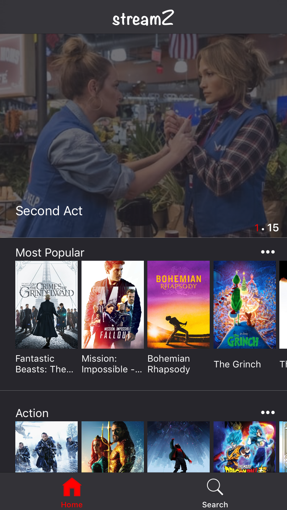
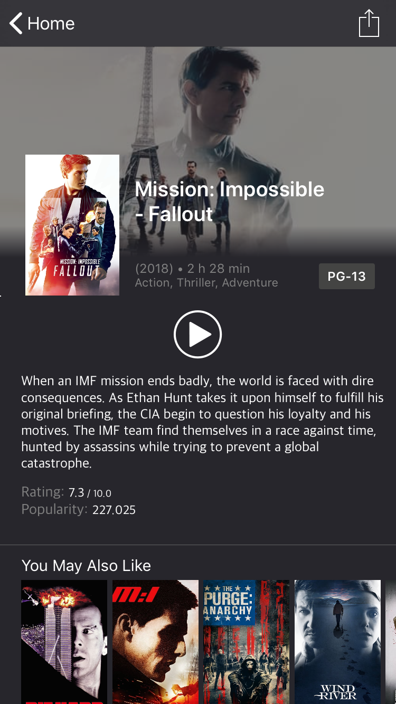
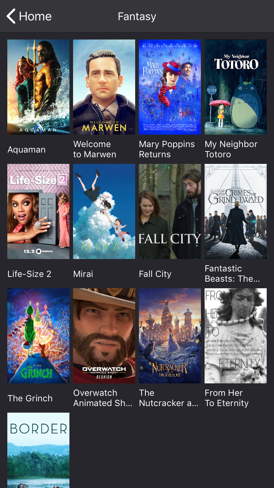
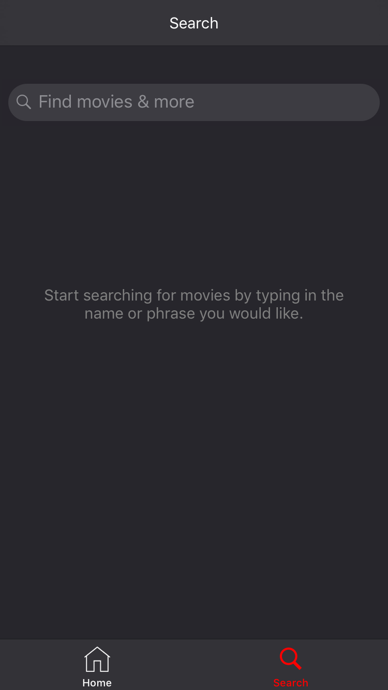
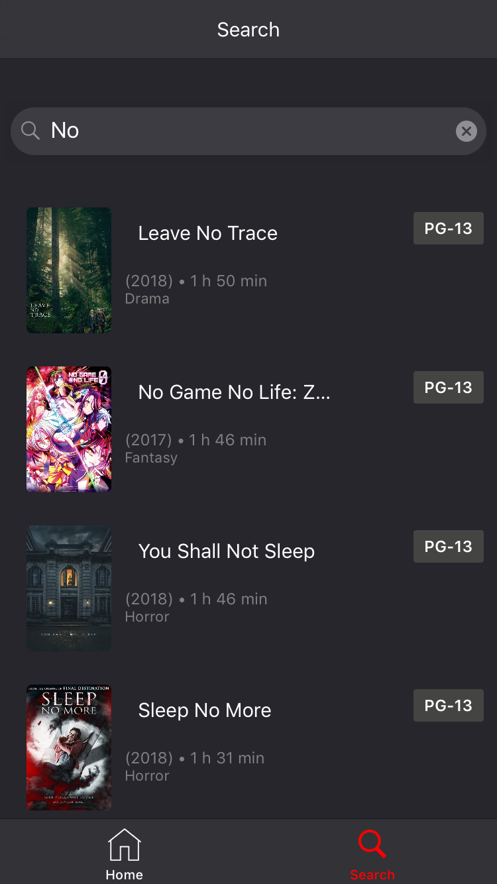

# StreamZ
[![Swift Version][swift-image]][swift-url]

An iOS app to browse and stream movies on our device. To prevent any copyright issues the video streamed is movie trailer from youtube.

## UI

#### Home
<kbd></kbd>

#### Movie Details
<kbd></kbd>

#### Genre
<kbd></kbd>

#### Search
<kbd></kbd>&nbsp;&nbsp;&nbsp;&nbsp;<kbd></kbd>

## Features

- [x] Browsing through list of popular and upcoming movies.
- [x] Browsing through movies of different genere.
- [x] Searching for movies containing search phrase.
- [x] Get details about the movie such as Rating, Genere, Year, Summary, Rating and popularity.
- [x] Stream the movie on your device (trailer from youtube).
- [x] Share movies with your friends.
- [x] Support for streaming movies using Chrome Cast.

## Requirements

- iOS 10.0+
- Xcode 9.3
- Swift 4.2
- The Movie Database API Key

## Modules/Integrations Used
- Alamofire to fetch data from the movie database
- Youtube Helper for loading and playing trailer from youtube.

## Meta

Raghav Bhasin – [@bhasin97](https://github.com/raghavbhasin97) – raghavbhasin97@gmail.com

[swift-image]:https://img.shields.io/badge/swift-4.2-orange.svg
[swift-url]: https://swift.org/
